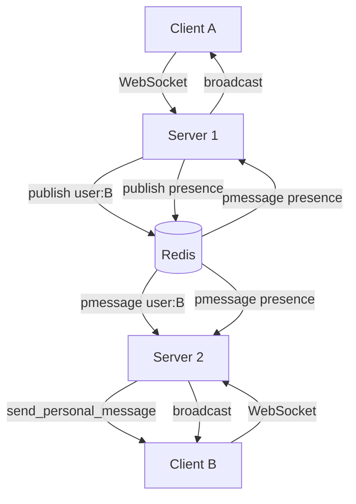

# voxChat

A real-time chat application built with FastAPI, WebSockets, and Redis Pub/Sub.

---

## Stack

- Backend: FastAPI, SQLAlchemy, SQLite (swap for Postgres in production)
- Real-time: WebSockets
- Pub/Sub: Redis
- Frontend: React, Vite, Tailwind
- Auth: JWT

---

## Redis Pub/Sub

Currently the app runs on a single server, so Redis Pub/Sub has no visible effect. The architecture is wired so that when you scale horizontally (multiple backend instances behind a load balancer), it works without any code change.

The problem Redis solves: User A is connected to Server 1. User B is connected to Server 2. Without Redis, Server 1 cannot reach User B's WebSocket. With Redis, Server 1 publishes the event to a channel. Server 2's subscriber picks it up and delivers it to User B locally.

Channel layout:

- `user:<id>` — direct messages, typing, seen, delivered
- `group:<id>` — group messages and group typing
- `presence` — online / offline broadcasts

---

## Architecture



---

## Setup

### Backend

```bash
cd backend
python -m venv venv
source venv/bin/activate
pip install -r requirements.txt
```

Add a `.env` file:

```
SECRET_KEY=your_secret_key
DATABASE_URL=sqlite:///chat.db
REDIS_URL=redis://localhost:6379
```

Start Redis locally:

```bash
docker run -d -p 6379:6379 redis:alpine
```

Run the server:

```bash
uvicorn main:app --reload --port 5000
```

### Frontend

```bash
cd frontend
npm install
npm run dev
```
